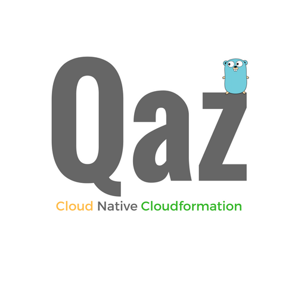

 <p align="center">
  
</p>

[](https://github.com/daidokoro/qaz/stargazers)
[](https://travis-ci.org/daidokoro/qaz)


__Qaz__ is a _cloud native_ AWS Cloudformation Template Management CLI tool that focuses on simplifying the process of deploying infrastructure on AWS via Cloudformation by utilising the Go Templates Library and custom functions to generate diverse and configurable templates.

For Qaz, being _cloud native_ means having no explicit local dependencies and utilising resources within the AWS Ecosystem to extend functionality. As a result Qaz supports various methods for dynamically generating infrastructure via Cloudformation.

Qaz emphasizes minimal abstraction from the underlying AWS Cloudformation Platform. It instead enhances customisability and re-usability of templates through dynamic template creation and logic.

--

*Features:*

- Advanced template functionality & custom built-in template functions

- Support for Cloudformation templates written in JSON & YAML

- Dynamic deploy script generation utilising the built-in templating functionality

- Single Yaml, JSON or [HCL](https://github.com/hashicorp/hcl) configuration file for multiple stack templates per environment

- Utilises Go-routines for Multi-stack concurrent Cloudformation requests for *all* appropriate calls

- Support for AWS Profile selection & Role switching for Multi-AWS account environments

- Cross stack referencing with support for Cloudformation Exports(_Preferred_) & dynamically retrieving stack outputs on deploy

- *Decoupled* build mechanism. Qaz can manage infrastructure by accessing config/templates via AWS Lambda, S3, or HTTP(S). The tool does not need to be in the same place as the templates/config.

- *Decoupled* stack management. Stacks can be launched individually from different locations and build consistently according to the dependency chain as long as the same configuration file is read.

- *Encryption* & *Decryption* of template values & deployment of encrypted templates using AWS KMS.

- Simultaneous Cross-Account or Cross-Region Stack Deployments.

- Support for fetching templates and configuration via Lambda Execution allows for dynamically generating Cloudformation using any of the Languages supported in AWS Lambda, (_Go_, _nodejs, python, java_, _etc_)

- __Troposphere__ & [GoFormation](https://github.com/awslabs/goformation) support via Lambda.

- Deploy Cloudformation directly from your Git Repo

- Support for [AWS Serverless Architecture Model (SAM) Templates](https://github.com/awslabs/serverless-application-model)

- Interactive Shell Mode

- Dynamic Config File generation using Template Functions (__New!__) - Allows configuration values to be retrieved using API calls, from S3, decrypted via _KMS_ and much more.


## Installation

If you have Golang installed:

`go get github.com/daidokoro/qaz`

On Mac or Linux:

```
curl https://raw.githubusercontent.com/daidokoro/qaz/master/install.sh | sh
```

Or, you may need _sudo_:

```
curl https://raw.githubusercontent.com/daidokoro/qaz/master/install.sh | sudo sh
```

## Requirements
qaz requires:

- AWS credentials, you can read about how to set these up [here](http://blogs.aws.amazon.com/security/post/Tx3D6U6WSFGOK2H/A-New-and-Standardized-Way-to-Manage-Credentials-in-the-AWS-SDKs)

## Quickstart

[](https://asciinema.org/a/bbuegywnih0x1r35epfdotrv5?speed=2)

## Checkout the [Wiki](https://github.com/daidokoro/qaz/wiki) for more on how Qaz works!

__Content___

- [Home](https://github.com/daidokoro/qaz/wiki)
- [Installation](https://github.com/daidokoro/qaz/wiki/Install)
- [Configuration](https://github.com/daidokoro/qaz/wiki/Config)
  - [Roles vs Profiles](https://github.com/daidokoro/qaz/wiki/Roles-vs-Profiles)
- [Custom Template Functions](https://github.com/daidokoro/qaz/wiki/Custom-Function)
- [Templating with Qaz](https://github.com/daidokoro/qaz/wiki/Templates)
- [Troposphere via Lambda](https://github.com/daidokoro/qaz/wiki/Troposphere)
- [Deploy using Git](https://github.com/daidokoro/qaz/wiki/Deploy-Using-Git)


--

See `examples` folder for more examples of usage. More examples to come.

```
$ qaz

Usage:
  qaz [flags]
  qaz [command]

Available Commands:
  change      Change-Set management for AWS Stacks
  check       Validates Cloudformation Templates
  completion  Output shell completion code for the specified shell (bash or zsh)
  deploy      Deploys stack(s) to AWS
  exports     Prints stack exports
  generate    Generates template from configuration values
  git-deploy  Deploy project from Git repository
  git-status  Check status of deployment via files stored in Git repository
  help        Help about any command
  init        Creates an initial Qaz config file
  invoke      Invoke AWS Lambda Functions
  lint        Validates stack by calling cfn-lint
  outputs     Prints stack outputs
  protect     Enables stack termination protection
  set-policy  Set Stack Policies based on configured value
  shell       Qaz interactive shell - loads the specified config into an interactive shell
  status      Prints status of deployed/un-deployed stacks
  terminate   Terminates stacks
  update      Updates a given stack
  values      Print stack values from config in YAML format

Flags:
      --debug            Run in debug mode...
  -h, --help             help for qaz
      --no-colors        disable colors in outputs
  -p, --profile string   configured aws profile (default "default")
      --version          print current/running version

Use "qaz [command] --help" for more information about a command.

```

--
## Roadmap and status
Qaz is now in __beta__, no more breaking changes to come. The focus from this point on is stability.

*TODO:*

- More Comprehensive Documentation
- More Deploy/Gen-Time Functions
- Tests!!

--

## Credits

- [pkazmierczak](https://github.com/pkazmierczak) - Qaz was originally a fork of the __Bora__ Project


# Contributing

Fork -> Patch -> Push -> Pull Request

_Pull requests welcomed...._
